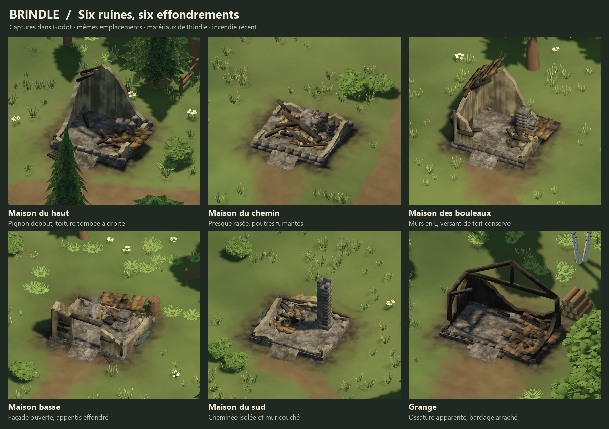
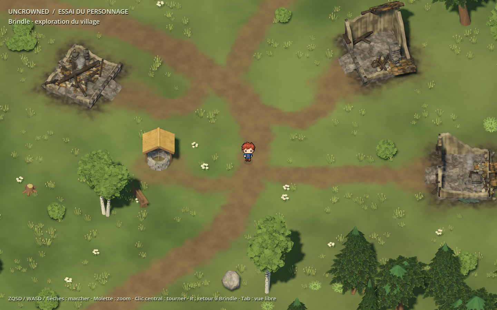

# Uncrowned — Brindle 3D graphics workshop

An editable **768 × 768 m 3D landscape with a 2D character**, prepared from the
existing Brindle test assets. The five houses and barn now have six individually
authored collapse patterns, charred materials, burned ground and two light smoke
emitters. Brindle follows winding paths between small yards and woodland edges.



## Open and play

Use **Godot 4.7.2**. From the repository root:

```sh
godot --headless --editor --path prototypes/brindle_3d --import --quit
godot --editor --path prototypes/brindle_3d
```

Press **F5** for `scenes/test_brindle.tscn`. To launch the preview directly:

```sh
godot --path prototypes/brindle_3d
```

On Windows, `Ouvrir-editeur.cmd` and `Lancer-map.cmd` accept the `GODOT` environment
variable, then look for Godot on the Desktop or on PATH. Python is only needed
to regenerate the regional height data, not to open, edit or play the project.

| Control | Character preview | Free map view, entered with Tab |
|---|---|---|
| ZQSD / WASD / arrows | Walk | ZQSD / WASD pan |
| Mouse wheel | Zoom | Zoom |
| Middle drag | Orbit | Orbit and tilt |
| Right drag | — | Pan |
| R | Return to Brindle spawn | Show whole map |
| B / I / T / C / M / F | — | Brindle / ironworks / sawmill / royal city / mine / lake |
| Tab | Switch to map | Return to character |



To inspect the sawmill directly, use **Ouvrir-village-scierie.cmd**. It opens the
actual playable workshop at the village square; **Tab** switches to the character.
The **T** shortcut frames this village in the free map camera. Its layout, water
levels and rebuilding steps are in [Sawmill village](planning/Scierie-village.md).

To inspect the mountain capital, use **Ouvrir-ville-chateau.cmd**, or press **C**
in the free map camera. See [Royal city and castle](planning/Ville-royale.md) for
its districts, 44 original assets, moat levels and editable ascent profile.

## What is included

- Northern/eastern mountains, river valleys, a lake, tributaries and west/south sea.
  The lake surface is 40 m, its central bed 33 m; the highest terrain is about 208 m.
- Working positions for Brindle, farming, sawmill and steel villages, and a city
  with a castle. Brindle, the ironworks, the sawmill, the royal city and the mine now have detailed construction.
- Brindle: five ruined houses, a ruined barn, a well, yards, nine curved routes,
  602 woodland trees and seven individual detail trees. The northern forest has
  another 295 trees.
- A mine entrance cut from the eastern hillside with native Godot CSG, a sorting
  area and a bridge across the steel-village tributary.
- Sawmill village: 15 distinct buildings in six editable district groups, 15 work
  props, 20 connected paths, gardens, a well, an animated waterwheel, a headrace,
  a tailrace and a sixth bridge connecting the village to the regional roads.
- Mountain capital: a high keep, palace and upper court; 34 distinct town/service
  buildings; district streets, market, chapel, ramparts, a walkable ascent, fed
  moats and a seventh bridge.
- The existing Brindle traveler spritesheet and directional walking animations,
  a camera and physical movement for assessing scale, slopes and access.
- Saved editable scenes, shaders, imported source models and offline reconstruction
  recipes. The original intact houses remain available beside the ruined variants.

The historical filename `scenes/map_plate.tscn` now contains the sculpted world.
`scenes/test_brindle.tscn` wraps it with the character preview. Terrain is split into
576 chunks; woodland and ground plants use cell-based MultiMeshes. These are
organization choices, not a performance guarantee on other hardware.

## Scope and relationship to the main game

This is the graphics and map-design workshop requested during the Brindle art pass.
It is independently runnable and **is not connected to the production simulation**:
its movement controller, world coordinates and ruins do not update `core/`, the
event log, saving, quests, people or dialogue. The parent `.gdignore` keeps this
project outside the production resource tree.

The working layout follows the map arrangement confirmed during that session.
It does not replace `docs/SPECS.md` or map production places to these meters.
Integrating it into the main game's replaceable `view/` layer remains a separate
step, including simulation-driven input, place states, navigation and asset validation.
The static burned village is a visual state for review, not a new story event.

## Edit and rebuild

| Guide / data | Purpose |
|---|---|
| [Editing Brindle](planning/Travailler-Brindle-dans-Godot.md) | Sector scenes, terrain stamps, paths and vegetation |
| [Ruin variants](planning/Maisons-en-ruines.md) | Six collapse recipes, collision shapes, fire and smoke |
| [Working geography](planning/Proposition-geographique.md) | Coordinates, elevations, water and reserved settlements |
| `planning/geographie-v1.json` | Regional geography source |
| `planning/assets-brindle-utilises.json` | Imported scenery resource paths |
| `planning/personnage-brindle.json` | Character source paths and original hashes |

Saved scenes work immediately after Godot import. Rebuilding is optional and
replaces generated scenes, so preserve manual edits first. In particular,
`tools/rebuild_organic_brindle.gd` must run **with graphics enabled**: on this Godot
version, headless saving does not preserve the vegetation MultiMeshes correctly.

To rebuild just the six ruins, from the repository root:

```sh
godot --headless --path prototypes/brindle_3d --script res://tools/build_recent_ruins.gd
```

`tools/build_landscape.py` needs Python and NumPy. Global resizing also requires
repositioning sectors and checking the mine and crossings; increasing the world
size alone stretches the existing 385 × 385 height grid instead of adding detail.

## Verification

From the repository root, using Bash (Git Bash on Windows):

```sh
GODOT=/path/to/godot bash prototypes/brindle_3d/tools/check_workshop.sh
GODOT=/path/to/godot bash tools/run_tests.sh --all
```

The workshop check imports its own resources, loads the saved scene, checks the
terrain and water, verifies six ruin instances and two smoke emitters, walks the
actual character through every entrance and checks the existing paths for obstacles.
The shell wrapper also fails on script errors. The production suite remains its
own check. Neither replaces looking at the renderer.

The six compositions and village preview were rendered and inspected in Godot
4.7.2 on Windows, Forward+ / D3D12. Current village views are under `apercus/`;
`map-relief-ensemble.png`, `map-lac.png` and `mine-acierie.png` record the regional
terrain/water and mine passes. Those regional shots predate the final village ruins.
No broader hardware performance claim is made.

## Source assets

`prototype_3d/` retains the assets, materials and movement scripts copied from the
user's Brindle test project; the imported source content and comments are retained
(Git normalizes text line endings). The manifest records the original source hashes
before that normalization. New ruin geometry reuses their mesh components and
material family, with separate burned material resources. The planning JSON files
retain the workshop's original French object labels to match the editor.

The selection is the Brindle source material explicitly requested for this workshop,
not an addition to the production NinjaAdventure palette. Provenance here records
the project and source files; it does not claim a new third-party asset license.
