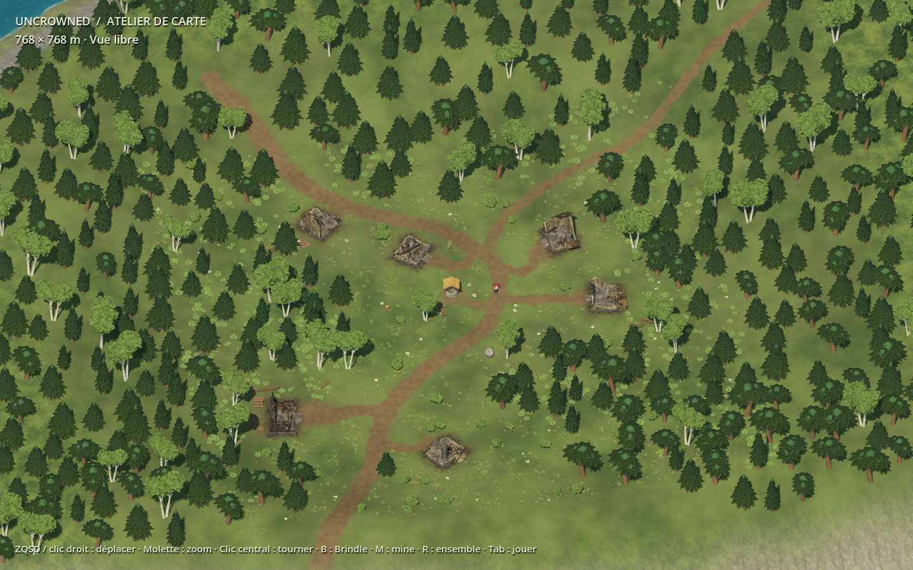

# Editing Brindle in Godot

Brindle follows a winding route through the woods. The five houses and barn have
different orientations and sit on pads between about 24.3 and 27.2 m. The well is
set back from the road; woodland and grass continue between the small yards.

## Scene organization

| Scene | Contents |
|---|---|
| `scenes/map_plate.tscn` | Editable world, terrain and sector instances |
| `scenes/test_brindle.tscn` | World plus movement preview and cameras |
| `scenes/sectors/brindle.tscn` | Buildings, route curves, yards and details |
| `scenes/sectors/forets_brindle.tscn` | Brindle woodland |
| `scenes/sectors/forets_nord_est.tscn` | Northern woodland |
| `scenes/sectors/mine_acierie.tscn` | Mine, sorting area, bridge and path |
| `scenes/relief_godot.tscn` | Local pads and slope controls |

F5 plays the character preview. Tab switches to map inspection, B frames Brindle,
M frames the mine and R shows the region. No NPC placement or dialogue is authored
by this workshop. Regional road connections and other settlements remain unfinished.

## Move a building

1. Open `scenes/sectors/brindle.tscn`, select `Maisons` and move or rotate a house.
2. Move its matching `SolMaison…` pad in `scenes/relief_godot.tscn`; match its rotation
   and footprint where necessary.
3. Review `scenes/map_plate.tscn`. The sector's **Reposer sur le terrain** action
   recalculates the altitude of anchored objects.
4. Adjust the path and ground paint, and regenerate the scorch mask for the new
   location. Save the edited scenes.

Editing the sector instance from the main scene creates local overrides. Choose one
editing location for each placement decision. See [ruin variants](Maisons-en-ruines.md)
to change a building's destruction independently of its placement.

## Shape slopes

`TerrasseBrindle` and `RampeNordBrindle` blend the overall slope. `SolMaisonHaut`,
`SolMaisonChemin`, `SolMaisonBouleaux`, `SolMaisonBasse`, `SolMaisonSud` and `SolGrange`
are the six building pads. The mine uses `CourMine`, `RampeMine` and `ApprocheMine`.

| Inspector field | Meaning |
|---|---|
| Position Y | Center altitude |
| Footprint M | Width and depth |
| Blend M | Transition to the surrounding terrain |
| Slope | X/Z gradient; 0.10 means 10% |
| Outline | Rectangular or elliptical outline |
| Undulation M | Small height variation |
| Appliquer au terrain | Apply manually if needed |

Terrain meshes, collisions and anchored objects follow these edits. Blue outlines
are editor helpers. Water areas are protected by default.

## Paint paths and grass

`assets/landscape/brindle_ground_mask.png` covers X 102–247 m and Z 193–313 m at
eight pixels per meter. Red means worn dirt, green dry grass variation, blue woodland
floor. The shader blends these directly on the terrain.

The `Path3D` nodes under `Brindle/TraceDesChemins` display the intended curves.
**Moving a curve alone does not repaint the mask.** For a generated revision, edit
`_prepare_routes()`, `_make_ground_mask()` and `LAYOUT` in
`tools/rebuild_organic_brindle.gd` together. Run that script with Godot's graphics
renderer enabled. A local paint-only change can instead edit the PNG directly.

This recipe replaces Brindle, its woodland, mask and placement data. Save manual
edits before rebuilding. `build_brindle_sectors.gd` supplies shared functions but
running that older tool directly restores the earlier layout.

The 602 woodland trees and ground plants are grouped into MultiMeshes by cell;
seven detail trees remain individual. Further sector work can tune draw distance
and shadows. A saved MultiMesh scene must be rebuilt with graphics, not headlessly.
